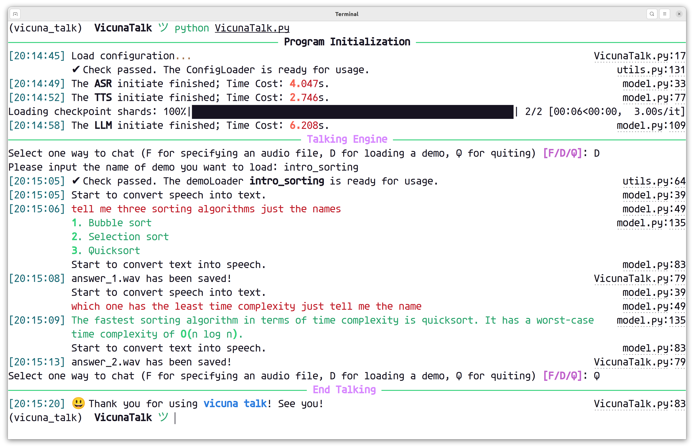

# Vicuna Talk

> A speech-to-speech talking bot based on [Vicuna & FastChat](https://github.com/lm-sys/FastChat), locally running on your computer.

<div align="center">
    
</div>

## Functions (in progress)
### 1. Specify audio file path
- record a piece of audio file yourself, which includes the question you would like to ask to Vicuna.
- run the program, and get an audio file with the answer included.

### 2. Generate / Use Demos
- load a sythetic demo and test it, so there is no need to record;
- write down the questions, and you can generate the demo yourself. No limit for the number of questions!

## Limitations
- English is the **only** language supported currently.
- The performance of the speech-to-text model is **not that POWERFUL**, so you may find out that when you record the audio yourself, the recognized text is sometimes in a mess. That's why we provide the "demo generation" function though.
- It may take long to load the models with only CPU.
- You may need to download the **Vicuna** dataset in advance. Check [the tutorial](https://huggingface.co/datasets/anon8231489123/ShareGPT_Vicuna_unfiltered).

## Talk to Vicuna!
clone the repo and cd into the directory.
```bash
> git clone
> cd VicunaTalk
```

**Check the instructions below first** (or you may probably fail to get it to work), and run `VicunaTalk.py` to talk!
```bash
> python VicunaTalk.py
```

## Instructions

### 1. Environment setup
Use `requirements.txt` to set up the conda virtual environment:
```bash
> conda env create -f environment.yml
> conda activate vicuna-talk
```

### 2. Modify Configurations
There are **two kinds of configurations** (`config.yaml`), one is for global models, and the other is for running demos.

1. The global one (in the root directory)
2. The demo one (in the `demo` directory)

In most cases, there is no need to change the demo one, before you know what you are doing. Check the demo part for detail.

#### Global configuration
This file contains some information for different models included.

```yaml
speech-to-text:
    model-id: "jonatasgrosman/wav2vec2-large-xlsr-53-english"

text-to-speech:
    model-id: "microsoft/speecht5_tts"
    vocoder: "microsoft/speecht5_hifigan"
    voice_path: XXXX # voice json path, modify this.

language-model:
    model-id: XXXX # vicuna model path, modify this.
    device: XXXX
    num_gpus: XXXX
    max_gpu_memory: XXXX
    load_8bit: XXXX
    cpu_offloading: XXXX
    temperature: XXXX
```

As mentioned above, modify these two settings, or it may never run as a program.

In the configuration, we referenced 2 models from HuggingFace, [speecht5_tts](https://huggingface.co/microsoft/speecht5_tts) and [wav2vec2-large-xlsr-53-english](https://huggingface.co/jonatasgrosman/wav2vec2-large-xlsr-53-english).


### 3. Demos
> What does a "demo" mean?
>
> A "demo" is a bunch of audio files including a series of questions, from recording or generating. When you are loading a demo, the questions are automatically sent to Vicuna in order, so you do not need to record every time.

Demos are stored in the `demo` folder, named with its topic. 

A demo consists of ...
- a `config.yaml` specifying all of its information
- a series of `.wav` audio files named in order, including the questions you want to ask.

### how to load a demo
Talk to vicuna, and choose "D" for loading demos. Type in the demo name, such as `intro_sorting` which is provided in the repo. And the questions in the audios will be asked to Vicuna one by one.

### how to generate my demo
Open `demo_creator.py`, you will see something like this:
```python
if __name__ == "__main__":
    # Put all of your questions here, one by one
    query = [
        "Tell me three sorting algorithms, just the names.",
        "Which one has the least time complexity? Just tell me the name.",
    ]

    # Put the name of the demo here
    d = Demo("intro_sorting", query)
    d()
```

After modifying the code, just run `python demo_creator.py`. And your demo will show up in the `demo` folder now!


